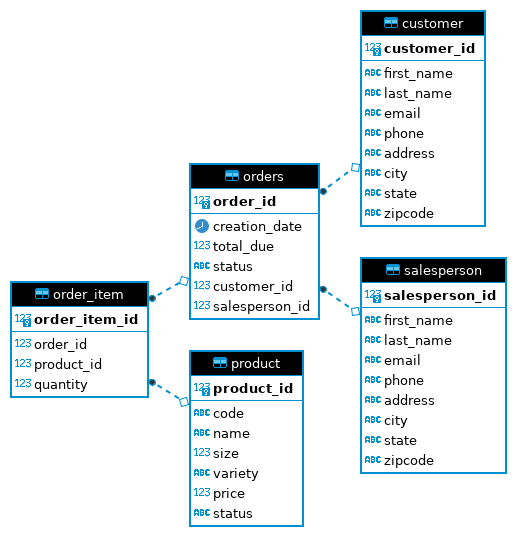

# Introduction
JDBC is a Java application that implements CRUD (create, read, update, delete) operations
using JDBC API to access and manipulate data in a relational database, Postgres. The design
pattern used in this project is DAO (Data Access Object). 

Technologies deployed in this project:
- JDBC
- PSQL
- Maven
- slf4j
- Docker
- Git
- Intellij IDE

# Implementation
The developed interfaces and classes, and their functionalities are:

- **DataAccessObject:** an abstract class that extends a DataTransferObject to the generics and 
  introduces CRUD abstract methods (ex. `findById()`, `findAll()`, `create()`,...)
- **DataTransferObject:** an interface that database objects are implemented from
- **DatabaseConnectionManager:** a class that handles all the connections to the database
- **Customer:** a class that implements DTO interface and represents Customer data from the database 
- **CustomerDAO:** a class extends DAO and implements CRUD methods for Customer data
- **Order:** a class that implements DTO interface and represents Order data from the database
- **OderItem:** a class that represents Order_Item data and is a sub-object of the Order data
- **OrderDAO:** a class extends DAO and implements CRUD methods for Order data
- **JDBCExecutor:** an entry point for the application, used to create a connection to database and 
  test the application

SQL scripts used to create `hplussport` database, data tables and insert sample data to
the database:

- database.sql
- customer.sql
- orders.sql
- product.sql
- salesperson.sql

## ER Diagram
Following ER diagram represents the relationships of entity sets stored in database for this project:



## Design Patterns
Two different design patterns can be considered for JDBC implementation: Repository pattern and 
DAO pattern. Here are some of the differences of these patterns:

- Repo pattern focuses only on single table access per class
- Repo pattern allows sharding of database to focus on single data access
- Joins in repo pattern are in code, instead of joining in database
- Repo pattern is useful for distributed databases as complex joins in database requires
  single-instance database and vertical scaling of database

The design pattern used in this project is DAO which is more suitable for centralized databases
and allows joining in database instead of code.

# Test
*Prerequisites:* docker and psql client are installed and postgres container is running.
1. Creating starter data
```
psql -h localhost -U postgres -f database.sql
psql -h localhost -U postgres -d hplussport -f customer.sql
psql -h localhost -U postgres -d hplussport -f product.sql
psql -h localhost -U postgres -d hplussport -f salesperson.sql
psql -h localhost -U postgres -d hplussport -f orders.sql
``` 

2. Run the application using IDE or maven:

```
mvn clean compile package
java -cp target/jdbc-1.0.0-SNAPSHOT.jar ca.jrvs.apps.jdbc.JDBCExecutor
```
3. Use psql client and run the sql statement to compare the results:

```
# connect to psql instance
psql -h localhost -U postgres -d hplussport

# run the sql statement
SELECT
  c.first_name, c.last_name, c.email, o.order_id,
  o.creation_date, o.total_due, o.status,
  s.first_name, s.last_name, s.email,
  ol.quantity,
  p.code, p.name, p.size, p.variety, p.price
from orders o
  join customer c on o.customer_id = c.customer_id
  join salesperson s on o.salesperson_id=s.salesperson_id
  join order_item ol on ol.order_id=o.order_id
  join product p on ol.product_id = p.product_id
where o.order_id = 1199;
```

```
# result:
Order{
  id=1199, 
  creationDate=Thu May 05 00:00:00 UTC 2016, 
  totalDue=55.35, 
  status='paid', 
  customerFirstname='Sharon', 
  customerLastName='Thompson', 
  customerEmail='sthompsonfw@indiegogo.com', 
  salesPersonFirstName='Roger', 
  salesPersonLastName='Sullivan', 
  salesPersonEmail='rsullivan1b@hplussport.com', 
  orderItems=
    [OrderItem{
      quantity=6, 
      productCode='MWPEA32', 
      productName='Mineral Water', 
      productSize=32, 
      productVariety='Peach', 
      productPrice=3.69}, 
    OrderItem{
      quantity=9, 
      productCode='MWPEA32', 
      productName='Mineral Water', 
      productSize=32, 
      productVariety='Peach', 
      productPrice=3.69}
    ]
  }

```