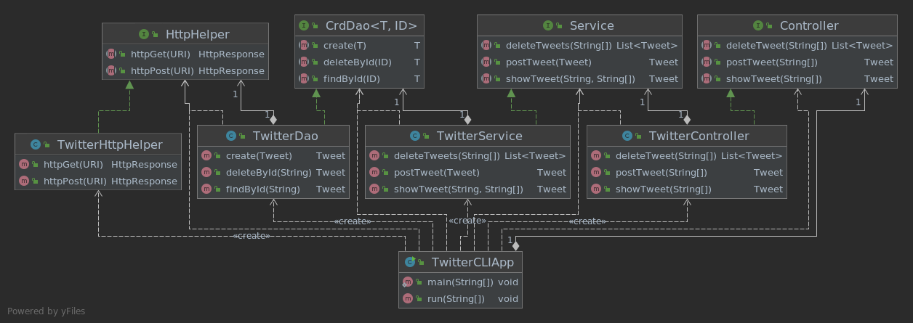

# Introduction
Twitter application is a java project using Twitter REST APIs and allows users to:
- Post a new tweet with a geotag 
- Search for a tweet by id and filter the response fields
- Delete list of Tweets by their ids 

The application implemented using MVC design pattern and consists of Models, Controller Layer,
Service Layer and Data Access Layer, described in more detail in the ***Design*** section.

Technologies deployed in this project:
- Core java
- Twitter REST API
- HTTP Client
- JSON libraries
- SpringBoot  
- Maven
- JUnit
- Mockito  
- Docker
- Git
- IntelliJ

# Quick Start
Application usage:

```
//post
post tweet_text latitude:longitude

//show
show tweet_id [field1,fields2] 

//delete
delete [id1,id2,..]
```

Packaging the application using maven:

```
cd ${project_dir}
mvn clean package
```

Running the application using docker:

```
docker pull shrsoheilien/twitter
docker run --rm \
-e consumerKey=YOUR_VALUE \
-e consumerSecret=YOUR_VALUE \
-e accessToken=YOUR_VALUE \
-e tokenSecret=YOUR_VALUE \
shrsoheilian/twitter delete 1200145224103841792
```

# Design
## UML Diagram
The following UML class diagram illustrates the main components of the application and their dependency relationship:



## Components
The project is designed based on MVC architecture and consists of the following components:

- Models: represents a tweet object in JSON format. All the models are implemented with POJO. 
- Data Access Layer: handles models and calls HttpHelper to access underlying storage/service (Twitter REST APIs). 
- Service Layer: handles business logic and validation before calling DAO layer.
- Controller Layer: interacts with user inputs, calls service layer and returns results.
- App/main: parses `args`, calls controller layer and prints results.

## Models
A simplified version of a tweet object, with the following properties, is implemented in this application:

```
{
   "created_at":"Mon Feb 18 21:24:39 +0000 2019",
   "id":1097607853932564480,
   "id_str":"1097607853932564480",
   "text":"test with loc223",
   "entities":{
      "hashtags":[
         {
            "text":"documentation",
            "indices":[
               211,
               225
            ]
         },
         {
            "text":"parsingJSON",
            "indices":[
               226,
               238
            ]
         }
      ],
      "user_mentions":[
         {
            "name":"Twitter API",
            "indices":[
               4,
               15
            ],
            "screen_name":"twitterapi",
            "id":6253282,
            "id_str":"6253282"
         }
      ]
   },
   "coordinates":{
      "coordinates":[
         -75.14310264,
         40.05701649
      ],
      "type":"Point"
   },
   "retweet_count":0,
   "favorite_count":0,
   "favorited":false,
   "retweeted":false
}
```

This abstract version of tweet object requires five models to be implemented with POJO (a class with 
private member variables and public getters and setters):

- Tweet: encapsulates tweet object and displays it in JSON format
- Coordinates
- Entities
- Hashtag
- UserMention

## Spring
To solve the dependency management(DM) problem, Spring framework is used instead of traditional dependency 
management which uses `main` method to create all the components and set up the dependency relationship manually.
Three different Spring approaches implemented for DM:

1. `@Beans`: implemented a Spring config file to define dependency relationships one by one.
2. `@ComponentScan`: used `@Autowired` annotation to inject dependencies through constructors. Implemented a 
Spring configuration file to scan through the package and get `@Component` 
3. SpringBoot: used `@SpringBootApplication` to configure Spring automatically.   
  
# Test
All the components have been tested using JUnit4 and both unit and integration testing approaches:

- Integrated test (IntTest) class implemented to test classes and their dependencies all together
- Unit test (UnitTest) class implemented to test the class itself without testing its dependencies using Mockito 
  framework 

# Deployment
The Twitter app is dockerized for easier distribution. The application image is tagged as
**shrsoheilian/twitter** and is available in hub.docker.com for download.
Below are the steps of dockerizing this application:

1. create a docker hub account
2. login to docker hub
3. create a dockerfile in the project root directory having the following steps:
    ```
    FROM openjdk:8-alpine
    COPY target/twitter*.jar /usr/local/app/twitter/lib/twitter.jar
    ENTRYPOINT ["java","-jar","/usr/local/app/twitter/lib/twitter.jar"]
    ```
4. package the project using maven

   `mvn clean package`


5. build a new docker image locally

   `docker build -t shrsoheilian/twitter .`


6. push image into dockerhub

   `docker push shrsoheilian/twitter`


# Improvements
- Improve the business login and data validation based on Twitter REST API requirements and limitations