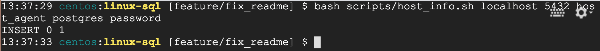

# Linux Cluster Monitoring Agent
## Introduction
Having a Linux cluster of nodes/servers which are running CentOS 7 and internally connected through a switch. 
This project aims to provide a monitoring agent which records hardware specifications of cluster nodes and monitors 
their resource usage in real-time. 

This tool is used by Linux Cluster Administration (LCA) team to have a better insight into servers, and their usage 
to meet the business requirements.  

Technologies deployed in this project:
* Bash scripting
* SQL
* Git
* GCP
* Docker

## Quick Start
#### 1. Start a psql instance 
```
./scripts/psql_docker.sh start psql_user psql_password
```
#### 2. Create tables 
```
psql -h psql_host -U psql_user -d psql_db -f sql/ddl.sql
```
#### 3. Insert hardware specification data into database 
```
./scripts/host_info.sh psql_host psql_port psql_db psql_user psql_password
```
#### 4. Insert hardware usage data into database
```
.scripts/host_usage.sh psql_host psql_port psql_db psql_user psql_password
```
#### 5. Crontab setup to automate inserting hardware usage data
```
crontab -e

* * * * * bash full_path_to_host_usage.sh psql_host psql_port psql_db psql_user psql_password &> /tmp/host_usage.log 

# to list crontab jobs
crontab -l 
```
#### 6. Get the report of the hosts
```
psql -h psql_host -U psql_user -d psql_db -f sql/queries.sql
```

## Implementation
The proposed monitoring agent is implemented as follows: 

- A `psql` docker instance is used to store data
- Each server runs different bash scripts and is connected to a switch to access the database 

### Architecture
This diagram illustrates the architecture of the proposed linux cluster with three linux hosts/servers.


### Scripts
Shell scripts implemented, and their usage are as follows:
* **psql_docker.sh**
  
    start/stop/create a `psql` container:
  ```
    # create container if not exits
    
    bash scripts/psql_docker.sh create psql_user psql_password

  
    # start container if it's already created

    bash scripts/psql_docker.sh start psql_user psql_password


    # stop container if it's already created
    
    bash scripts/psql_docker.sh stop psql_user psql_password
  ```


* **host_info.sh**
  
    collect hardware specifications (hostname, cpu number, total memory,...) of the server and insert data to `psql` 
    instance by running an insert statement to `host_info` table through `psql` CLI tool:

    `bash scripts/host_info.sh psql_host psql_port psql_db psql_user psql_password`
  

* **host_usage.sh** 
  
    collect server resource usage data (free memory, idle cpu time, cpu kernel, ...) and insert it to `psql` instance 
    by running an insert statement to `host_usage` table through `psql` CLI tool:

    `bash scripts/host_usage.sh psql_host psql_port psql_db psql_user psql_password`
  

* **crontab** 
  
    automate `host_usage.sh` script and execute it every minute, so server resource usage data will be collected and
    stored in the database every minute


* **ddl.sql**
  
  create host_info and host_usage tables if not exists in database:
  
  `psql -h psql_host -U psql_user -d psql_db -f sql/ddl.sql`


* **queries.sql** 
    
    collection of queries to report data and answer business questions including:
    - average memory usage (percentage) over 5-minute interval for each host
    - detect host failure in case a server inserts less than three data points within 5-minute interval
    - list of hosts, and their memory size group by CPU number
    
    `psql -h psql_host -U psql_user -d psql_db -f sql/queries.sql`
      
### Database modeling
Hardware specification and usage data are stored in `host_info` and `host_usage` tables, respectively.

#### *host_info* table
column_name | type | constraint | description
----------- | ----- | --------------- | -----------
id | serial | primary_key, not null | unique id corresponding to each server
hostname | varchar | unique, not null | unique host name of server 
cpu_number | int | not null | number of server CPUs 
cpu_architecture | varchar | not null | server cpu architecture
cpu_model | varchar | not null | server cpu model
cpu_mhz | float | not null | cpu frequency
L2_cache | int | not null | l2 cache size in Kb
total_mem | int | not null | total memory in Kb 
timestamp | timestamp | not null | current time


#### *host_usage* table
column_name | type | constraint | description
----------- | ----- | --------------- | --------
id | serial | primary_key, not null | unique id corresponding to usage record
timestamp | timestamp | not null | current time 
host_id | serial | foreign_key, not null | host id from the host_info table
memory_free | int | not null | free memory in MB
cpu_idle | small int | not null | time spent idle in percentage
cpu_kernel | small int | not null | time spent running kernel code in percentage
disk_io | small int | not null | number of disk I/O
disk_available | int | not null | root directory available disk in MB

## Test
Following screenshots shows how to test scripts and SQL queries. The result of running scripts and queries are also
shown:





    
## Improvements
- Implement a bash script to handle hardware updates. In case of a server hardware upgrade, run the script to update 
  the corresponding server hardware specifications. 
- Create a table to keep server hardware specification history (host_info_history) for performance and report purposes.
- Develop queries for more business questions and reports such as hosts average idle time group by cpu number and 
  detect daily peak hours of cpu_kernel usage 